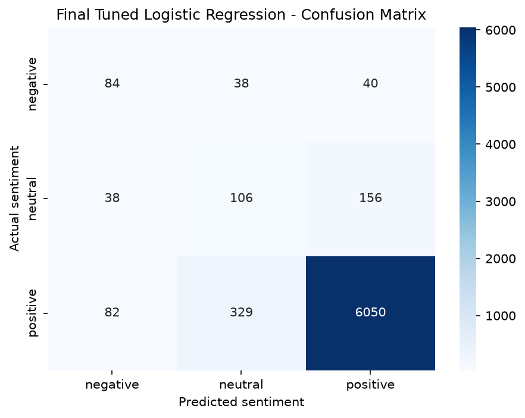

# Automated Customer Reviews

An NLP project that analyzes Amazon customer reviews through **sentiment classification, product clustering, and AI-generated category buying guides**.

**Live demo:** [Try the sentiment analyzer](https://automated-customer-reviews.streamlit.app/)

## Project Overview

Thousands of customer reviews can be difficult to analyze manually. This project explores ways to turn review text into useful signals: predict its sentiment, group similar products, and summarize customer feedback into category-level recommendations.

## Features

* **Sentiment analysis:** Classifies a review as positive, neutral, or negative. The Streamlit app also displays a probability for each class.
* **Product clustering:** Uses TF-IDF features and K-Means to group products into interpretable meta-categories.
* **Buying guides:** Uses prepared category-level review evidence and Claude to generate summaries covering popular products, common complaints, and recommendations.

## Method

1. Explore and preprocess the review dataset.
2. Train and evaluate sentiment classifiers using TF-IDF features.
3. Compare Logistic Regression, Multinomial Naive Bayes, and Linear SVM using accuracy and macro F1.
4. Select Logistic Regression for the deployed sentiment analyzer based on its balanced performance across sentiment classes and comparable cross-validation results.
5. Compare K-Means clustering configurations for 4–6 groups and label the resulting product categories.
6. Prepare category-level review evidence and generate buying guides with Claude.

## Sentiment Model Results

The final Logistic Regression model achieved **86.00% accuracy** on the held-out test set.

Because the dataset is highly imbalanced toward positive reviews, we compared models using **macro F1 as well as accuracy**. Accuracy alone can be misleading when one class dominates the dataset.

Multinomial Naive Bayes reached **93.33% accuracy** but only **32.19% macro F1**, with an F1-score of zero for both negative and neutral reviews. Logistic Regression performed more evenly across the three sentiment classes.

Linear SVM achieved a slightly higher macro F1 than Logistic Regression (**54.83% vs. 53.97%**), but the cross-validation ranges nearly overlap. We therefore used Logistic Regression for the deployed demo because it provided comparable overall performance while producing a well-balanced baseline across the sentiment classes.

| Sentiment | Precision | Recall | F1-score | Test samples |
| --------- | --------: | -----: | -------: | -----------: |
| Negative  |       33% |    59% |      42% |          162 |
| Neutral   |       17% |    43% |      24% |          300 |
| Positive  |       98% |    89% |      93% |        6,461 |

### Confusion Matrix

Rows represent the actual class, while columns represent the predicted class.

| Actual \ Predicted | Negative | Neutral | Positive |
| ------------------ | -------: | ------: | -------: |
| Negative           |       96 |      42 |       24 |
| Neutral            |       57 |     129 |      114 |
| Positive           |      142 |     590 |    5,729 |



## Product Category Summaries

The project contains generated buying guides for the following categories:

* Amazon Device Accessories & Chargers
* Echo & Kindle Fire Devices
* Echo & Smart Home Devices
* Fire Kids Edition Tablets & Accessories
* Kindle & Fire Devices – Special Offers
* Kindle Fire Tablets – 16GB

See the [reports/summaries/](reports/summaries/) directory for the full guides.

## Run the Sentiment App Locally

Install the required dependencies:

```bash
pip install -r app/requirements.txt
```

Start the Streamlit application:

```bash
streamlit run app/app.py
```

## Project Structure

```text
Automated-Customer-Reviews/
│
├── app/
│   ├── app.py
│   └── pages/
│
├── data/
│   ├── raw/
│   └── processed/
│
├── models/
│
├── notebooks/
│
├── reports/
│   ├── figures/
│   └── summaries/
│
├── requirements.txt
└── README.md
```

* `app/` — Streamlit sentiment analysis app and dashboard pages
* `data/` — raw and processed review datasets
* `models/` — saved sentiment and clustering models
* `notebooks/` — exploration, preprocessing, modeling, clustering, and summary workflows
* `reports/` — confusion matrix and generated category buying guides

## Limitations

The test set contains substantially more positive reviews than neutral or negative reviews.

The lower F1-scores for neutral and negative reviews show that overall accuracy does not tell the whole story. The model can identify positive reviews reliably, but distinguishing neutral and negative reviews remains more challenging.

Similarly, the generated category buying guides depend on the quality and coverage of the underlying review data and should therefore be treated as **analysis aids rather than definitive purchasing recommendations**.
