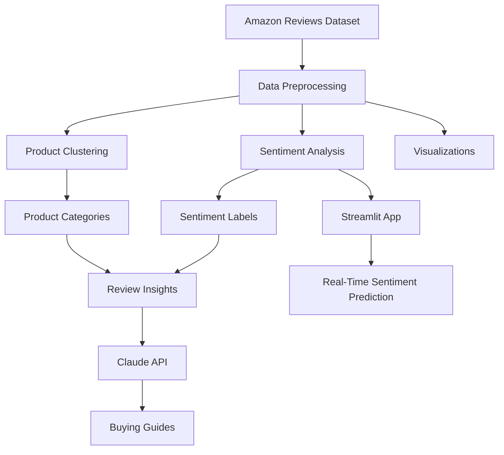

# 🛍️ Automated Customer Review Analysis System

An end-to-end Natural Language Processing (NLP) project that automatically analyzes Amazon customer reviews to extract valuable insights. The system performs sentiment classification, product category clustering, generative AI review summarization, visualization and provides a deployable sentiment analysis web application.

🚀 **Live Demo:** https://automated-customer-reviews.streamlit.app/

## 📌 Project Overview

Online shopping platforms contain thousands of customer reviews, making it difficult for consumers and businesses to manually analyze feedback. This project leverages modern NLP and Generative AI techniques to transform large amounts of customer review data into useful insights about customer sentiment, product categories, complaints, and overall product performance.

## 🏗️ System Architecture

```text
┌─────────────────────┐
│  Amazon Reviews     │
│      Dataset        │
└──────────┬──────────┘
           │
           ▼
┌─────────────────────┐
│ Data Preprocessing  │
│ • Cleaning          │
│ • Deduplication     │
│ • Feature Creation  │
└──────────┬──────────┘
           │
   ┌───────┴────────┐
   │                │
   ▼                ▼
┌──────────┐   ┌─────────────┐
│Sentiment │   │ Clustering  │
│ Analysis │   │   Model     │
│ (Task 1) │   │  (Task 2)   │
└────┬─────┘   └──────┬──────┘
     │                │
     ▼                ▼
 Sentiment      Product Categories
 Predictions          │
     │                │
     └────────┬───────┘
              ▼
      Review Insight Extraction
              │
              ▼
         Claude API
              │
              ▼
     Summary Generation
          (Task 3)
              │
              ▼
        Recommendation
           Articles

┌─────────────────────┐
│  Streamlit App      │
│     (Task 4)        │
└──────────┬──────────┘
           ▼
  Real-Time Sentiment
      Prediction

┌─────────────────────┐
│ Bonus Visualizations│
│ • Sentiment Trends  │
│ • Cluster Analysis  │
│ • Product Insights  │
└─────────────────────┘
```


## 📊 Primary Dataset
**Amazon Product Reviews**
- Source: Kaggle
- File Used: `1429_1.csv`
- Size: ~34,000 reviews 

## ✨ Main Features

* **Sentiment Analysis** – Classify customer reviews into  Positive, Neutral, or Negative.
* **Product Category Clustering** – Group similar products into meaningful meta-categories using TF-IDF features and K-means.
* **Buying guides** – Generate category-level summary articles.
* **Web Application Deployment** – Provide an accessible interface for sentiment prediction.
* **Bonus - Visualization** - Visualize important patterns and insights from the review dataset.


## 📊 Sentiment Analysis Results

The final **Logistic Regression** model achieved **86.0% accuracy** and was selected as the deployment model due to its balanced performance across all sentiment classes.

| Sentiment | Precision | Recall | F1-Score |
|-----------|----------:|--------:|---------:|
| Negative | 33% | 59% | 42% |
| Neutral | 17% | 43% | 24% |
| Positive | 98% | 89% | 93% |

## Confusion Matrix
 
The model performs very well on positive reviews while maintaining reasonable detection of negative and neutral sentiments despite the dataset's class imbalance.
 
reports/figures/cm_final_model.png


## Product Category Clustering
The second task uses unsupervised learning to group similar products into product meta-categories.
Since the original dataset contains many individual products, clustering helps organize them into broader categories. 

## Approach
- Prepare product-level information.
- Convert product information into numerical representations.
- Apply clustering using K-means.
- Determine an appropriate number of clusters.
- Assign each product to a cluster.
- Analyze the products within each cluster.
- Give meaningful names to the resulting clusters.


## 🤖 AI-Powered Product Category Review Summarization
 
Product insights extracted from clustered reviews are sent to the Claude API to generate concise recommendation-style summaries. Each summary highlights key products, customer sentiment, common complaints, and notable review trends, helping users quickly understand product categories without reading thousands of reviews.

See the [reports/summaries/](reports/summaries/) directory for the full guides.


## 🛠️ Technologies Used
 
| Category | Tools & Technologies |
|-----------|---------------------|
| **Programming Language** | Python |
| **Data Processing** | Pandas, NumPy |
| **Natural Language Processing** | Scikit-learn, TF-IDF, Text Vectorization, N-gram Analysis, Sentiment Analysis |
| **Visualization** | Matplotlib, Seaborn |
| **Machine Learning** | Scikit-Learn |
| **Generative AI** | Claude API is used to generate category-level summary |
| **Deployment** | Streamlit |


## Run the Sentiment App Locally

Install the required dependencies:

```bash
pip install -r app/requirements.txt
```

Start the Streamlit application:

```bash
streamlit run app/app.py
```

## Project Structure

```text
Automated-Customer-Reviews/
│
├── app/
│   ├── app.py
│   └── pages/
│
├── data/
│   ├── raw/
│   └── processed/
│
├── models/
│
├── notebooks/
│
├── reports/
│   ├── figures/
│   └── summaries/
│
├── requirements.txt
└── README.md
```

* `app/` — Streamlit sentiment analysis app and dashboard pages
* `data/` — raw and processed review datasets
* `models/` — saved sentiment and clustering models
* `notebooks/` — exploration, preprocessing, modeling, clustering, and summary workflows
* `reports/` — confusion matrix and generated category buying guides

## Limitations

The test set contains substantially more positive reviews than neutral or negative reviews.

The lower F1-scores for neutral and negative reviews show that overall accuracy does not tell the whole story. The model can identify positive reviews reliably, but distinguishing neutral and negative reviews remains more challenging.

Similarly, the generated category buying guides depend on the quality and coverage of the underlying review data and should therefore be treated as **analysis aids rather than definitive purchasing recommendations**. 

# Authors
**Haripriya Pushpamangalam Kesavan, **
**Anita Kiran** 

---
 
# License
 
This project was developed for educational and research purposes.


```text
Amazon Reviews Dataset
         │
         ▼
   Pandas / NumPy
 Data Preprocessing
         │
         ▼
      TF-IDF
         │
 ┌───────┴────────┐
 ▼                ▼
Logistic      K-Means
Regression   Clustering
(Task 1)     (Task 2)
 ▼                ▼
Sentiment    Categories
Results
      \      /
       \    /
        ▼  ▼
  Review Insights
        │
        ▼
   Claude API
        │
        ▼
 Buying Guides
        │
        ▼
 Streamlit App
```





```text
┌─────────────────────┐
│ Amazon Reviews Data │
└──────────┬──────────┘
           │
           ▼
┌─────────────────────┐
│ Data Preprocessing  │
│ • Cleaning          │
│ • Deduplication     │
│ • Feature Creation  │
└──────────┬──────────┘
           │
 ┌─────────┴─────────┐
 │                   │
 ▼                   ▼
Sentiment       Product Category
Analysis          Clustering
(Task 1)          (Task 2)
 │                   │
 ▼                   ▼
Sentiment      Meta-Categories
Labels
 │                   │
 └───────┬───────────┘
         ▼
 Review Insights
 Extraction
         │
         ▼
    Claude API
         │
         ▼
 Category Buying
     Guides
   (Task 3)

         ▼
  Streamlit App
   (Task 4)
         │
         ▼
 Real-time Review
 Classification
```
